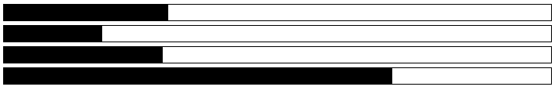

# progress

  Simple progress bars

## Unstyled Screenshot

  

## Themes

  - [Bootstrap](https://github.com/jb55/bootstrap-progress)

## Installation

    $ component install jb55/progress

## API

Simply update the style.width attribute on `.bar` to update the bar width.
Animations are handled in css automatically.

### new Progress(el)

Simple utility for changing bar sizes

### Progress#update(percent)

Percent is a number from `0-100`. This is a simple wrapper around style.width
for `.bar` elements.

## License

  MIT
